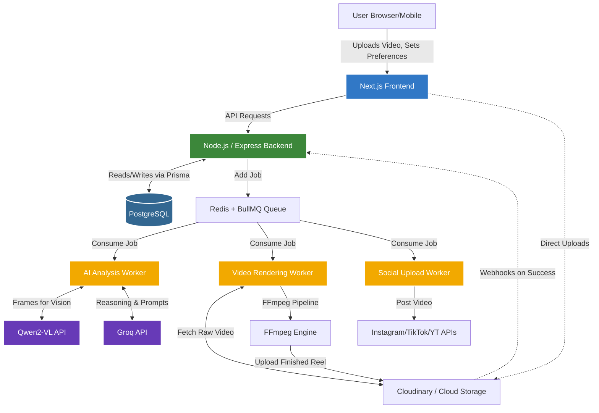

# Wedding Reel Automation Platform: Architecture & Learning Blueprint

Welcome! I'm thrilled to mentor you on this journey. Building a scalable, AI-powered media processing system is a fantastic way to level up from a beginner to an advanced full-stack engineer. 

This document serves as your **North Star**. It breaks down how real-world production systems are built, explains every piece of our technology stack, and provides a clear, phase-by-phase roadmap.

---

## 1. The Big Picture: How Production Systems Work

In a production environment, a system isn't just one big block of code (a "monolith" that does everything synchronously). If a user uploads a 500MB wedding video, they shouldn't have to stare at a loading spinner for 10 minutes while the server analyzes the video and renders a reel. 

Instead, modern systems are **asynchronous and decoupled**:
1. **The Client (Frontend):** Takes the video and uploads it.
2. **The API (Backend):** Saves the video details to a database, tells a background worker "Hey, there's a new video to process," and immediately replies to the user: "Got it! We'll notify you when it's done."
3. **The Queue (Message Broker):** Acts as a waiting room for tasks.
4. **The Workers:** Background servers that pick up tasks from the queue (like AI vision analysis or FFmpeg rendering), do the heavy lifting, and update the database when finished.

This separation ensures that your web server remains fast and responsive, no matter how many heavy video rendering jobs are happening in the background.

---

## 2. System Architecture Diagram

Here is a visual representation of how data flows through our platform.



---

## 3. Technology Stack & Responsibilities

Let's break down exactly what each piece of technology does in your system.

### Frontend (Next.js, React, TailwindCSS)
*   **Role:** The face of the application. It's what the user sees and interacts with.
*   **Next.js:** Provides routing (pages), server-side rendering for SEO, and API routes if needed. It makes building React apps production-ready.
*   **React:** Used to build interactive UI components (drag-and-drop uploaders, video players, settings forms).
*   **TailwindCSS:** A utility-first CSS framework. It lets you style components directly in your HTML/JSX, making it incredibly fast to build beautiful, modern interfaces.

### Backend (Node.js, Express.js, TypeScript)
*   **Role:** The brain and traffic controller. It handles business logic, authentication, and database interactions.
*   **Express.js:** A lightweight framework for creating API endpoints (e.g., `POST /api/projects`, `GET /api/reels`).
*   **TypeScript:** Adds strict typing to JavaScript. As a beginner, it might feel like extra work, but it catches 80% of bugs before you even run the code. It acts as documentation for your code.

### Database (PostgreSQL, Prisma)
*   **Role:** The long-term memory of the system.
*   **PostgreSQL:** A highly reliable relational database. It stores users, projects, video metadata, and job statuses.
*   **Prisma:** An ORM (Object-Relational Mapper). Instead of writing raw SQL queries (`SELECT * FROM users`), you write simple TypeScript (`prisma.user.findMany()`). It's incredibly developer-friendly.

### Queue System (Redis, BullMQ)
*   **Role:** The task manager.
*   **Redis:** An extremely fast, in-memory database. 
*   **BullMQ:** A queue library that runs on top of Redis. It handles job scheduling, retries if a job fails, and tracking progress (e.g., "Rendering is at 45%").

### AI Workflow (Qwen2-VL, Groq)
*   **Role:** The creative director.
*   **Workflow:** 
    1. We extract keyframes (images) from the user's raw video.
    2. We send these frames to **Qwen2-VL** (a vision-language model) to understand what is happening (e.g., "Bride walking down the aisle," "Luxury floral decor," "Dimly lit romantic mood").
    3. We take Qwen's vision data and feed it into a fast language model via **Groq** to generate a creative decision: "Based on this romantic, luxury vibe, use the 'Cinematic Slow-Mo' template, add a vintage color grade, and generate these captions."

### Video Rendering (FFmpeg)
*   **Role:** The cutting room.
*   **FFmpeg:** The industry standard for video manipulation. It's a command-line tool that can trim, merge, add music, overlay text, and apply filters deterministically based on the instructions generated by the AI.

### Storage & Socials
*   **Cloudinary:** Stores raw uploads and finished reels. It also offers some on-the-fly transformations.
*   **Social APIs:** Used to schedule and push the final MP4 files to the user's social accounts.

---

## 4. The Architecture of a Video Pipeline

Here is exactly what happens when a user clicks "Automate Reel":

1.  **Upload:** Frontend uploads raw video directly to Cloudinary (bypassing our server to save bandwidth).
2.  **API Call:** Frontend tells the Backend: "Video uploaded. URL is X. Mood is 'Romantic'."
3.  **Queue:** Backend creates a database record (Status: `PROCESSING`) and drops a job into BullMQ: `ANALYZE_VIDEO`.
4.  **Worker 1 (AI Vision):** 
    *   Downloads video.
    *   Uses FFmpeg to extract 1 frame every 3 seconds.
    *   Sends frames to Qwen2-VL.
    *   Saves visual tags to DB.
    *   Adds next job to queue: `PLAN_EDIT`.
5.  **Worker 2 (AI Logic):**
    *   Takes visual tags + user preferences.
    *   Asks Groq to pick a rendering template (e.g., exact timestamps to cut, which overlay to use).
    *   Adds next job to queue: `RENDER_VIDEO`.
6.  **Worker 3 (FFmpeg Render):**
    *   Runs the deterministic FFmpeg command (e.g., `ffmpeg -i input.mp4 -ss 00:01 -to 00:05 ...`).
    *   Uploads final reel to Cloudinary.
    *   Updates DB (Status: `DONE`).
7.  **Notification:** Frontend, polling the database or listening via WebSockets, sees the status is `DONE` and shows the final video.

---

## 5. Folder Structure

A clean, modular folder structure is crucial. We will use a "monorepo" style layout.

```text
wedora/
├── frontend/               # Next.js Application
│   ├── src/
│   │   ├── app/            # Pages & Routing (Next.js App Router)
│   │   ├── components/     # Reusable UI (Buttons, VideoPlayer)
│   │   ├── hooks/          # Custom React hooks (e.g., useUpload)
│   │   ├── lib/            # Utilities (API clients, formatting)
│   │   └── types/          # Shared TypeScript interfaces
│   ├── package.json
│   └── tailwind.config.ts
│
├── backend/                # Express.js API & Workers
│   ├── src/
│   │   ├── controllers/    # Route logic (Req/Res handling)
│   │   ├── routes/         # Express router definitions
│   │   ├── services/       # Core business logic (DB calls)
│   │   ├── ai/             # Qwen/Groq integration scripts
│   │   ├── ffmpeg/         # Video editing templates & wrappers
│   │   ├── workers/        # BullMQ job processors
│   │   └── index.ts        # Server entry point
│   ├── prisma/             # Database schema
│   │   └── schema.prisma
│   ├── package.json
│   └── tsconfig.json
│
└── docker-compose.yml      # To easily run Redis/Postgres locally
```

---

## 6. Development Roadmap & Phases

Do not try to build everything at once. We will build this in 5 distinct phases.

### Phase 1: The Foundation (Week 1)
*   **Goal:** Setup the environment and basic data flow.
*   **Tasks:**
    *   Initialize Next.js frontend and Express backend.
    *   Setup PostgreSQL and Prisma. Create `User` and `Project` schemas.
    *   Build a simple UI to upload a video to Cloudinary.
    *   Save the Cloudinary URL to the database.

### Phase 2: The Queue & FFmpeg Basics (Week 2)
*   **Goal:** Learn background processing and video manipulation.
*   **Tasks:**
    *   Setup Redis via Docker.
    *   Implement BullMQ in the backend.
    *   Create a worker that takes an uploaded video and uses FFmpeg to simply extract audio or cut the first 5 seconds.
    *   Get comfortable with the FFmpeg command line.

### Phase 3: AI Vision & Reasoning (Week 3)
*   **Goal:** Make the system "smart".
*   **Tasks:**
    *   Integrate Qwen2-VL API. Write a script to send it 5 frames of a video and parse the JSON response.
    *   Integrate Groq API. Write a prompt that takes the vision output and selects an editing style.
    *   Wire these steps into the BullMQ workflow.

### Phase 4: Deterministic Templates (Week 4)
*   **Goal:** The core editing engine.
*   **Tasks:**
    *   Create 2-3 hardcoded FFmpeg templates (e.g., "Flashy Cut", "Slow Fade").
    *   Write a service that translates the Groq output into precise FFmpeg commands.
    *   Render the final video, upload it, and display it on the frontend.

### Phase 5: Social Automation & Polish (Week 5+)
*   **Goal:** Production readiness.
*   **Tasks:**
    *   Integrate Instagram/TikTok APIs for OAuth and uploading.
    *   Add error handling (what happens if FFmpeg crashes?).
    *   Refine the frontend UI (Tailwind polish, loading states).

---

## 7. Learning Roadmap for You

As a beginner, you might encounter concepts you don't know yet. Here is the order in which you should learn them as we build:

1.  **TypeScript Basics:** Learn Interfaces, Types, and how to type function arguments.
2.  **Express.js REST APIs:** Understand GET, POST, Request (req), Response (res), and Middleware.
3.  **Relational Databases:** Understand what a Table is, Primary Keys, and Foreign Keys (e.g., how a Project belongs to a User).
4.  **Promises & Async/Await:** **CRITICAL.** You must master asynchronous JavaScript to handle API calls, database reads, and file uploads.
5.  **React Hooks:** Understand `useState` (holding data) and `useEffect` (doing things when the component loads).
6.  **FFmpeg:** Learn basic commands in your terminal before trying to run them via Node.js.

---

> [!NOTE]  
> **How to proceed:** 
> Review this architecture document carefully. If the design makes sense, we can begin **Phase 1** immediately. I will guide you through initializing the project folders, setting up Next.js and Express, and getting our database connected. Let me know if you approve this plan or have any questions about the concepts explained above!
